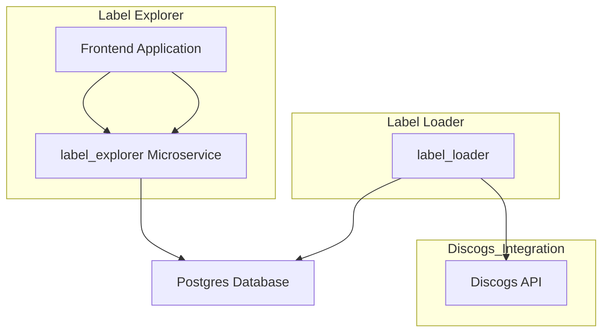

# Label Explorer

# Overview



I decided to create label loader as a standalone command line tool. Decision I made was due to the structure of Discogs API and its rate limitation.
In order to display grouped data based on its style/genre we need to access each release resource_url one by one. Doing that while reading would require user to wait for a long time.

This is why I decided to create a command line tool to fetch it and store it in groupings which allow for fast reads. In commercial project in order to keep data fresh I would suggest running such command in form of a scheduled job. 

# Run

1. Update `.env` file
Fill up keys without values with your Discogs API key and secret, database user and password.


2. Run tests
```shell
cd ./backend && go test ./... && cd ../cmd && go test ./... && cd ..
```

3. Start docker-compose
```shell
docker-compose up -d
```

4. Run command to load label data
```shell
cd ./cmd/ && go build . && ./label_loader && cd ..
```

- Frontend will be available at http://localhost:3000
- Backend API will be available at http://localhost:8081


# If I had more time
**I would improve test coverage**

With the time limitation I've skipped some unit tests. I would also add integration tests that would test operation on dockerized database instead of mocked one. 

**I would invest more time in refactoring**

I think cmd package could be improved in terms of clean code. 

**I would have add pagination**

This is not the hardest task, but it always adds a bit of complexity and I decided to skip this considering time limitations.

**I would improve frontend**

I must admit that frontend application is not great. 
It does not support sorting (although backend API allows for that) and is not very clean.